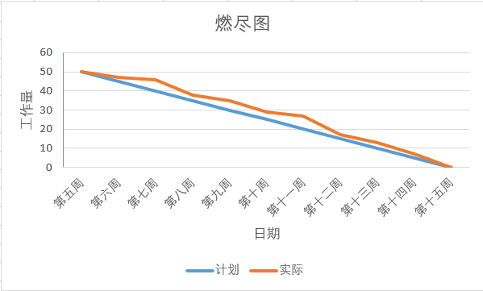
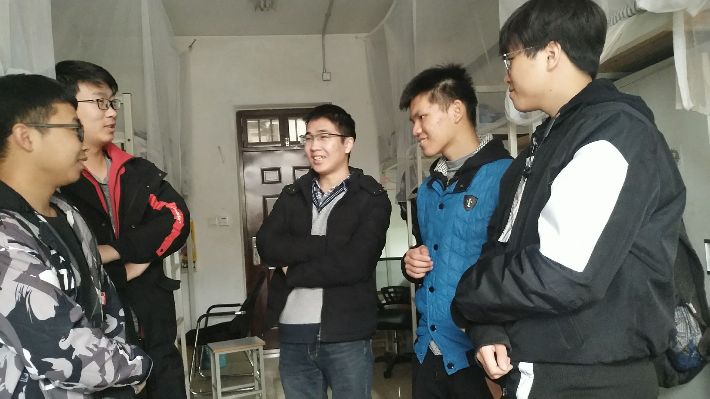
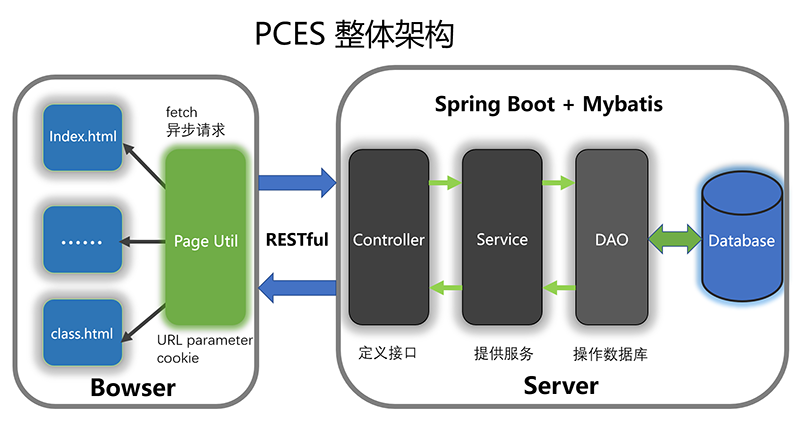

####  1. 项目成员分工和预期计划 

* **孙浩杰：**

  任务：项目整体架构的设计，前端页面的整体设计，前后端交互接口的设计与编码，后端SpringBoot+mybatis+swagger2集成和编码，部分数据库的设计。

  已完成：项目整体架构的设计，前端页面的整体设计，前后端交互接口的设计与编码，后端SpringBoot+mybatis+swagger2集成和编码，部分数据库的设计。

  感想：在整个项目开发的过程中，我们从开始设计到最后编码实现一直井然有序的进行，开发过程中分工明确，大家也都很配合和努力。虽然在团队协作开发的过程中我们遇到了许许多多的问题，例如接口不统一，编码规范不一致，数据库设计缺陷等等，但是我们都一一认真解决了问题。我们在GitHub上提交的issues 见证着我们的努力。虽然最终项目没有我们预期中完成的好，但是基本的功能都实现了。我觉得这对我们项目小组来说团队协作开发的是一次很好的尝试与实践。

* **宋自康：**

  任务：部分数据库设计，用户界面的原型设计与编码，前端页面与后端接口数据交互。

  已完成：设计了部分数据库，完成了前端用户界面原型设计与编码，前端页面于后端接口数据交互。

  感想：遇到了很多以前从未遇到过的技术问题，但都通过各种方法解决了，从中学到了很多，积累了很多项目经验。体验到了软件的开发过程，学到了很多软件工程的知识，学会了博客的编写，锻炼了团队协作、沟通能力。

* **孙肖肖：**

  任务：注册、登陆界面原型设计与编码，项目测试，编写测试报告。

  已完成：负责用户登陆界面和用户注册界面UI设计和前端代码的编写，编写beta阶段测试报告，编写了项目测试报告，参与项目测试用例，负责燃尽图。

  感想：自己编程方面不强，遇到bug后不能很快的解决，在此次项目中，团队分工明确，效率很高，体现出了团队合作的重要性。 

* **谭明耀：**

  任务：部分页面的原型设计和前端设计，标签功能的前后端实现，课程详情页面的前后端数据交互

  已完成：部分页面的原型设计和前端设计，标签功能的前后端实现，课程详情页面的前后端数据交互

  感想：通过本次项目，我逐步了解学习了软件工程设计的主要流程，在项目推进中认识到了团队合作的重要性。此外我还对项目中的相关技术有了一定的了解，如mybatis，bootstrap框架等。尽管我们项目的功能并没有得到完整的实现，我也从中学到了许多，在今后的学习中，我会学以致用，更高效的完成项目。

* **王观山：**

  任务：负责前端部分页面的编码，项目测试，编写测试文档

  已完成：任务为部分前端页面设计，beta阶段会议博客的以及总结报告的编写，测试查找前端页面bug，测试前后端交互bug，以及测试报告的编写。

  感想：我认为我的收获很大，这是一个小组项目，理想工作与实际工作不同是正常的，小组长协调大家的长处短处。在找bug的过程中要有耐心，积极听取大家的意见，查找可能出问题的点。我认为这次项目对培养我的耐心以及提升工作能力有很大的帮助。

* **王明鑫：**

  任务：负责前端部分页面的编码，项目测试，编写测试文档
  已完成：完成了密码与邮箱修改的页面，完成了项目的功能测试，编写了第八周，第九周的会议报告和beta阶段测试报告
  我的心得：学到了团队合作的重要性，也学到了不少软件工程的知识，对于每个阶段的工作有了更深的认识，对以后的工作和学习有很大的帮助。

#### 2. 项目的实际进度曲线、燃尽图

#### 3. 实际遇到哪些问题，是如何解决的 ？

1. 问题：团队成员积极性不高，如何提高成员的积极性与参与度？
   * 在项目开发过程中，组员积极性不高，导致项目进度拖延；
   * 各模块进度不统一，开发效率低下。
   * 在以后的开发中，应该更加细化开发目标，为每次的开发任务设置deadline，相互多督促，加强彼此之间的沟通。
2. 问题：数据库设计存在不足，如何设计完备的数据库？
   * 在开发过程中有些前端需要的的数据，但在设计数据库的时候并没有设计相关的字段，导致相关功能无法正常实现，需要重新设计数据库，修改后端代码，成本较大。
   * 有些数据库表的机构设计不够合理导致后期功能不太好实现
   * 应该在设计数据库之前做好充分的前期工作，首先完成前端功能和页面的设计。再具体对前端数据需求和流程加以分析，进一步确定所需要的数据。综合这些再设计数据库。
3. 问题：前后端接口不统一，如何设计高效可用的统一数据交换接口？
   * 在开发过程中，有时会遇到后端接口返回数据与预期不符的情况，会导致前后端数据无法有效交互
   * 前后端共同约定 Api 接口文档，共同遵守约定编码和开发。前端根据接口约定请求数据，后端根据接口约定实现接口。
4. 问题：GitHub使用不熟练，提交总是冲突，如何解决冲突？
   * 明确各自的职责范围，每个人有自己负责的模块和文件，每个人只在自己职责范围内的文件中编码，不允许修改别人负责的文件。 
   * 如果需要修改别人的代码，应当与其负责人沟通，由对方进行修改提交后重新拉取。 
   * 积极学习github使用方法，保证操作规范。 
   * 每次开始编码前应当先从主库拉取最新项目代码，编码结束后应当及时push代码。 
5. 问题：前后端分离之后的前端该如何请求数据与渲染以及页面之间如何传递数据？
   * 前端通过 js 调用 fetch 请求后端的接口，请求参数为 json 格式，返回数据为 json 格式。
   * 对于数据设计渲染模板，通过 js 将渲染模板转换为 html元素，并将数据插入其中，再将模板插入 document 中完成渲染工作。
   * 页面之间的路由与数据传递一方面可以通过 url 参数获得，另一方面可以通过 cookie 传递。
6. 问题：一系列开发过程中遇到的技术问题详见 [GitHub issues](https://github.com/sunshine2285/PCES/issues?q=is%3Aissue+is%3Aclosed)

* 总结：本次的项目开发不同于以往项目开发，以往的项目的开发主要是一两个人做，沟通成本低，沟通比较有效，很少存在协作分工的问题。但是这一次，我们采用团队协作争取每一位同学参与项目，一同协作，共同完成整个项目。在这个过程中我们遇到了很多问题，很多坑。例如：GitHub协作的时候提交代码总是存在冲突，前后端约定的接口没有遵守等等，在克服这一系列困难的过程中，我们充分体会到了团队协作的重要性。必须要指定团队的代码规范，开发规范。沟通是十分必要的，而且在有些时候有效的沟通可以帮助我们节省许多时间，少走很多弯路。

####  4. 一张觉得效果最好的SCRUM会议照片 

####  5. 项目的实际架构：前后端框架，使用的技术，部署的流程 

* **整体架构**

* **使用的技术**
  * 前端：html + css + js
  * 前后端交互：js + fetch
  * 后端：java，SpingBoot + mybatis + mysql
* **部署**
  * 前后端分离部署
  * 前端部署在 apache server
  * 后端直接采用springboot的打包技术，生成可独立运行的 jar 包，内置tomcat，直接作为独立线程部署在服务器

#### 6. 描述项目测试的工作安排、测试工具的选择和使用，项目测试评述 

**测试工作的安排**：

| 组员学号    | 组员姓名 | 测试工作       |
| ----------- | -------- | -------------- |
| 17020031063 | 孙肖肖   | 注册功能       |
|             |          | 登录功能       |
| 17020031069 | 王观山   | 标签功能       |
|             |          | 基本信息修改   |
|             |          | 邮箱与密码修改 |
| 17020031071 | 王明鑫   | 查询功能       |
|             |          | 评论功能       |

**测试工具选择和使用**：

对于前端采用黑盒测试，暂时未找到合适的测试工具，因此我们手动测试我们的项目。

对于后端采用单元测试，使用 JUnit 编写测试类测试。

**测试用例**：

| 用例编号 | 用例名称       | 测试背景               | 前置条件                         | 重要级 | 优先级 | 测试环境 | 测试类型 | 测试阶段 | 测试步骤                             | 预期结果                         | 实际结果                         | 测试人员 |
| -------- | -------------- | ---------------------- | -------------------------------- | ------ | ------ | -------- | -------- | -------- | ------------------------------------ | -------------------------------- | -------------------------------- | -------- |
| 1        | 注册成功       | 测试注册功能           | 输入个人基本信息                 | 高     | 高     | chrome   | 手工测试 | 系统测试 | 进入注册页面输入个人信息，点击注册。 | 注册成功并跳转到登陆界面。       | 注册成功并实现跳转。             | 孙肖肖   |
| 2        | 注册失败       | 测试注册功能           | 输入错误的个人基本信息           | 高     | 高     | chrome   | 手工测试 | 系统测试 | 进入注册页面输入错误个人信息。       | 注册失败。                       | 注册失败                         | 孙肖肖   |
| 3        | 未注册账号登陆 | 测试登录功能           | 输入未注册的帐号                 | 高     | 高     | chrome   | 手工测试 | 系统测试 | 进入登录页面，登录未注册的帐号       | 登录失败，提示该用户不存在。     | 登录失败，提示该用户不存在。     | 孙肖肖   |
| 4        | 已注册帐号登录 | 测试登录功能           | 输入已注册帐号                   | 高     | 高     | chrome   | 手工测试 | 系统测试 | 进入登陆页面，登陆已注册帐号         | 登录成功，跳转到主页。           | 登录成功，跳转到主页。           | 孙肖肖   |
| 5        | 查询功能       | 测试按课程名称搜索功能 | 输入有效课程名称搜索             | 高     | 高     | chrome   | 手工测试 | 系统测试 | 输入课程名称搜索                     | 跳转到课程详情页面，显示课程信息 | 跳转到课程详情页面，显示课程信息 | 王明鑫   |
| 6        | 查询功能       | 查询没有的课程名       | 输入无效的课程名称进行搜索       | 高     | 高     | chrome   | 手工测试 | 系统测试 | 输入无效课程名并查询                 | 跳转到搜索结果页面显示无结果     | 跳转到搜索结果页面显示无结果     | 王明鑫   |
| 7        | 评论功能       | 测试添加评论           | 已上过该课程                     | 高     | 高     | chrome   | 手工测试 | 系统测试 | 输入评论点击发送                     | 发送成功，评论显示在评论区       | 发送成功，评论显示在评论区       | 王明鑫   |
|          | 评论功能       | 测试添加评论           | 游客模式                         | 高     | 高     | chrome   | 手工测试 | 手工测试 | 输入评论点击发送                     | 无法添加评论                     | 无法添加评论                     | 王明鑫   |
| 9        | 标签功能       | 测试添加标签           | 已上过该课程                     | 高     | 高     | chrome   | 手工测试 | 系统测试 | 点击添加，选择相关标签               | 添加成功                         | 添加成功                         | 王观山   |
| 10       | 修改基本信息   | 修改除邮箱外个人信息   | 登录到主页，并点击修改信息       | 高     | 高     | chrome   | 手工测试 | 系统测试 | 点击输入修改内容并提交               | 修改成功                         | 修改成功                         | 王观山   |
| 11       | 修改邮箱       | 修改邮箱               | 登录到个人信息页面，点击修改邮箱 | 高     | 高     | chrome   | 手工测试 | 系统测试 | 输入新的邮箱，点击修改               | 修改成功                         | 修改成功                         | 王观山   |
|          | 修改密码       | 修改密码               | 登录到个人信息页面，点击修改密码 | 高     | 高     | chrome   | 手工测试 | 系统测试 | 输入新的密码并确认修改               | 修改成功                         | 修改成功                         | 王观山   |

**项目测试评述：**

此次测试中，运用了黑盒测试与单元测试方法。通过测试发现，实现了开始计划的大部分功能，但是由于时间关系仍有一部分功能未实现，比如说评论点赞功能，按老师名字搜索课程功能等。已经完成的功能测试中，并未出现bug，测试样例顺利通过，项目取得了初步的成功。

#### 7.  各个成员的过程体会 

* **孙浩杰：**在整个项目开发的过程中，我们从开始设计到最后编码实现一直井然有序的进行，开发过程中分工明确，大家也都很配合和努力。虽然在团队协作开发的过程中我们遇到了许许多多的问题，例如接口不统一，编码规范不一致，数据库设计缺陷等等，但是我们都一一认真解决了问题。我们在GitHub上提交的issues 见证着我们的努力。虽然最终项目没有我们预期中完成的好，但是基本的功能都实现了。我觉得这对我们项目小组来说团队协作开发的是一次很好的尝试与实践。

  已完成：项目整体架构的设计，前端页面的整体设计，前后端交互接口的设计与编码，后端SpringBoot+mybatis+swagger2集成和编码，部分数据库的设计。

  感想：在整个项目开发的过程中，我们从开始设计到最后编码实现一直井然有序的进行，开发过程中分工明确，大家也都很配合和努力。虽然在团队协作开发的过程中我们遇到了许许多多的问题，例如接口不统一，编码规范不一致，数据库设计缺陷等等，但是我们都一一认真解决了问题。我们在GitHub上提交的issues 见证着我们的努力。虽然最终项目没有我们预期中完成的好，但是基本的功能都实现了。我觉得这对我们项目小组来说团队协作开发的是一次很好的尝试与实践。

* **宋自康：**遇到了很多以前从未遇到过的技术问题，但都通过各种方法解决了，从中学到了很多，积累了很多项目经验。体验到了软件的开发过程，学到了很多软件工程的知识，学会了博客的编写，锻炼了团队协作、沟通能力。

* **孙肖肖：**自己编程方面不强，遇到bug后不能很快的解决，在此次项目中，团队分工明确，效率很高，体现出了团队合作的重要性。 

* **谭明耀：**通过本次项目，我逐步了解学习了软件工程设计的主要流程，在项目推进中认识到了团队合作的重要性。此外我还对项目中的相关技术有了一定的了解，如mybatis，bootstrap框架等。尽管我们项目的功能并没有得到完整的实现，我也从中学到了许多，在今后的学习中，我会学以致用，更高效的完成项目。

* **王观山：**我认为我的收获很大，这是一个小组项目，理想工作与实际工作不同是正常的，小组长协调大家的长处短处。在找bug的过程中要有耐心，积极听取大家的意见，查找可能出问题的点。我认为这次项目对培养我的耐心以及提升工作能力有很大的帮助。

* **王明鑫：**学到了团队合作的重要性，也学到了不少软件工程的知识，对于每个阶段的工作有了更深的认识，对以后的工作和学习有很大的帮助。

